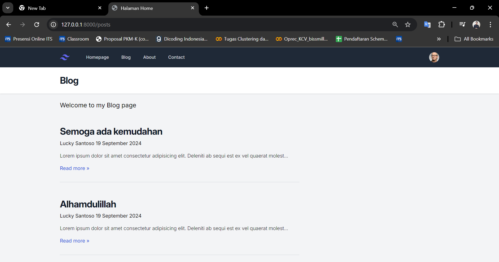
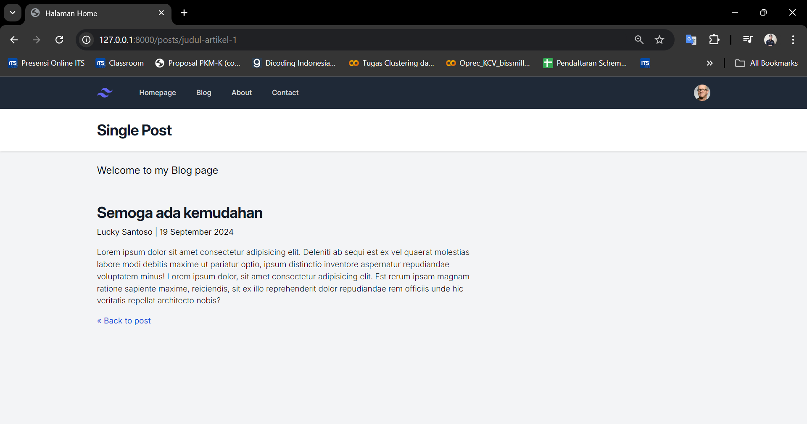
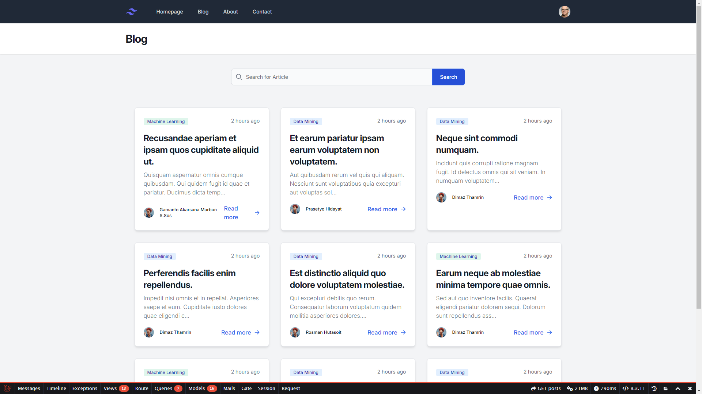
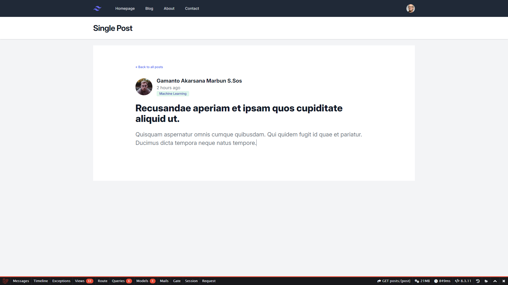

|    NRP     |      Name      |
| :--------: | :------------: |
| 5025221050 | Lucky Santoso  |

## Tugas 1

## Tugas 2

Menambahkan List post dari implementasi View Data, dan implementasi slug pada link router website. Serta website telah mampu menampilkan single post ketika user melakukan event click pada salah satu _posts_.

Tidak Hanya itu, website telah menerapkan metode Models _posts_ untuk mengatur data post mana yang akan di tampilkan pada _view_.

## Final Website

Menambahkan semua implementasi materi laravel di classroom.

### Page Posts

### Page Single Post

